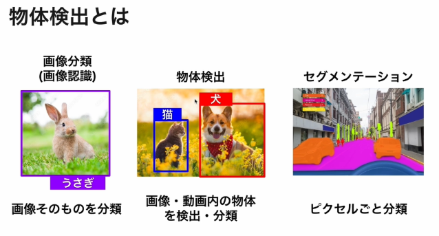

# AidemyのYOLO講座を通じてローカル環境に実行環境を作成するプロジェクトです。

## 物体検出とは？


## 導入までの流れ
1. Aidemyからデータセットを入手。カスタムデータセットならアノテーションする: https://dev-partner.i-pro.com/space/TPFAQ/1007060562/%E3%82%A2%E3%83%8E%E3%83%86%E3%83%BC%E3%82%B7%E3%83%A7%E3%83%B3%E3%83%84%E3%83%BC%E3%83%AB%E3%80%8ElabelImg%E3%80%8F%E3%82%92%E4%BD%BF%E3%81%A3%E3%81%9FAI%E3%83%A2%E3%83%87%E3%83%AB%E4%BD%9C%E6%88%90

2. 仮想環境を作成
   ### ポイント！torchのインストール上手くいかないと次のステップにすすめない。
   1. importする際にosエラーdllファイルが見つからない。バージョン変更で解決(python3.12)
```
# 一度アンインストール
pip uninstall torch torchvision torchaudio

# バージョンを指定してインストール
pip install torch==2.3.1 torchvision==0.18.1 torchaudio==2.3.1

```
これも必要かもC++のやつ: https://learn.microsoft.com/ja-jp/cpp/windows/latest-supported-vc-redist?view=msvc-170
3. config.ipynbでコンフィグデータを作成
4. yolov8,ipynbで学習
   1. epoc数をあげていくと精度が上昇していくがある程度のレベルになると向上率が緩やかになる
5. 


### メモ
- バッチサイズは2の累乗が基本
  - データ量が少ない場合は32や64の少ない値の方が良い結果となる傾向がある
- 局所最適解とは？
- バッチサイズにおける局所最適解について、中学生にも分かりやすく説明しましょう。

1. まず、「バッチサイズ」とは：
   コンピューターが一度に学習するデータの量のことです。例えば、100枚の写真を10枚ずつ学習するなら、バッチサイズは10です。

2. 「局所最適解」とは：
   ある範囲内で最も良い結果に見えるけれど、実は全体で見るともっと良い結果があるような状態のことです。

3. 分かりやすい例え：
   山登りをしているとイメージしてください。目的は一番高い山頂に到達することです。
   - 全体最適解：本当の山頂（一番高い場所）
   - 局所最適解：小さな頂上（周りより高いけど、本当の山頂ではない場所）

4. バッチサイズと局所最適解の関係：
   - 小さすぎるバッチサイズ：細かい道を見ながら登るので、小さな頂上（局所最適解）に止まりやすくなります。
   - 大きすぎるバッチサイズ：広い範囲を見ながら登るので、本当の山頂を見つけやすいですが、細かい道を見落とすかもしれません。

5. バランスの重要性：
   ちょうど良いバッチサイズを選ぶことで、細かい道も見ながら、でも全体の山の形も把握して、本当の山頂（全体最適解）に到達しやすくなります。

6. 実際の意味：
   コンピューターが学習するとき、ちょうど良い量のデータを使うことで、より正確な結果を得られるようになります。

このように、バッチサイズを適切に選ぶことは、コンピューターが本当に良い結果（全体最適解）を見つけるのに重要なのです。小さすぎても大きすぎても、最良の結果を得るのが難しくなる可能性があります。

# ハイパーパラメータの解説
もちろんです。このサンプルコードで設定されているハイパーパラメータについて詳しく解説します。


```python
results = model.train(data = 'raccoon-cat.yaml',
                      name = run_name,
                      epochs = 30,
                      batch = 32,
                      optimizer = 'Adam',
                      seed = 1,
                      lr0 = 0.004,
                      lrf = 0.004
)

```

このコードで設定されているハイパーパラメータの詳細は以下の通りです：

1. `data = 'raccoon-cat.yaml'`
   - データセットの設定ファイルを指定しています。
   - この YAML ファイルには、訓練データと検証データのパス、クラス名などが記述されています。

2. `name = run_name`
   - 学習の実行名を指定します。
   - 結果のログや保存されるモデルのファイル名に使用されます。

3. `epochs = 30`
   - 学習を繰り返す回数を指定します。
   - 1エポックは、全訓練データを1回使用することを意味します。

4. `batch = 32`
   - バッチサイズを指定します。
   - 1回の学習更新で使用する画像の数です。
   - 大きいバッチサイズは学習を安定させますが、より多くのメモリを必要とします。

5. `optimizer = 'Adam'`
   - 最適化アルゴリズムを指定します。
   - Adamは適応的な学習率調整を行う人気のオプティマイザーです。

6. `seed = 1`
   - 乱数のシードを設定します。
   - 再現性を確保するために使用されます。同じシードを使用すれば、同じ初期条件から学習を開始できます。

7. `lr0 = 0.004`
   - 初期学習率を指定します。
   - 学習の開始時にこの値が使用されます。

8. `lrf = 0.004`
   - 最終学習率を指定します。
   - 学習率スケジューラーがこの値を使用して、学習中に学習率を調整します。

これらのパラメータは、モデルの学習過程と最終的な性能に大きな影響を与えます。最適な値は、データセットの特性やモデルの規模、使用可能な計算リソースなどによって異なります。多くの場合、これらの値を調整しながら最適な結果を得るために複数回の実験が必要となります。

# Ir(学習率について)
学習率（Learning Rate、略してLR）について、もう少し詳しく説明しましょう。

学習率は、機械学習モデル、特にニューラルネットワークの学習プロセスにおいて非常に重要なハイパーパラメータです。以下に、中学生にも理解しやすいように説明します：

1. 学習率の基本概念：
   - 学習率は、モデルが各学習ステップでどれだけ大きく調整するかを決める「歩幅」のようなものです。

2. わかりやすい例え：
   - 山を下る人をイメージしてください。目標は山の頂上から谷底（最適解）に到達することです。
   - 学習率は、その人が1歩で進む距離に相当します。

3. 学習率の役割：
   - 大きな学習率：大きな歩幅で進みます。素早く谷底に近づける可能性がありますが、谷底を飛び越えてしまうリスクもあります。
   - 小さな学習率：小さな歩幅で慎重に進みます。正確に谷底に到達できますが、時間がかかります。

4. 初期学習率（lr0）の意味：
   - 学習の開始時に使用される学習率です。
   - コードの例では、`lr0 = 0.004`と設定されています。

5. 学習率の調整：
   - 多くの場合、学習が進むにつれて学習率を徐々に小さくしていきます。
   - これは、大まかな位置を素早く見つけた後、より細かい調整を行うためです。

6. 最終学習率（lrf）：
   - 学習の終盤で使用される学習率です。
   - コードの例では、`lrf = 0.004`と設定されています。この場合、学習率は一定のままです。

7. 学習率の重要性：
   - 適切な学習率を選ぶことは、モデルの学習成功に大きく影響します。
   - 大きすぎると学習が不安定になり、小さすぎると学習が遅くなったり、局所最適解に陥ったりする可能性があります。

8. 学習率の調整方法：
   - 固定学習率：全学習過程で一定の値を使用
   - 学習率スケジューリング：学習の進行に応じて徐々に学習率を変更
   - 適応的学習率：データやモデルの状態に応じて自動的に学習率を調整（Adamオプティマイザーなど）

適切な学習率を見つけるのは、しばしば試行錯誤が必要な過程です。多くの場合、複数の値で実験を行い、最も良い結果を得られる学習率を選びます。

この例では、初期学習率と最終学習率が同じ値（0.004）に設定されていますが、これは特定の状況下での選択であり、多くの場合、学習の進行に応じて学習率を調整することが一般的です。